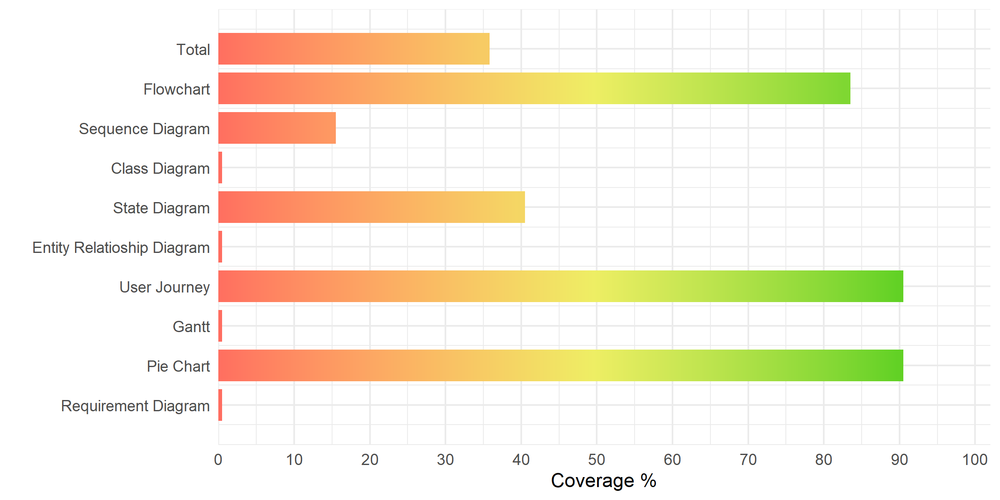

# PyMermaid

PyMermaid is a simple to use mermaid wrapper built in python.

---
## Features

Using the object-oriented programming style of python, we can achieve some
interesting result in the way of _programming the graph_.

#### Some examples

```python
from PyMermaid.mermaid import flowchart as f

f.set_layout(f.layout_leftToRight)

n1 = f.add_node("Start",shape = 1)
n2 = f.add_node("Decision",shape = f.nodeShape_rhombus)
n3 = f.add_node("Result one")
n4 = f.add_node("Result two")

a = f.add_arrow(type=f.arrowType_normalArrow)

f.link(n1,n2,a)
f.link(n2,[n3,n4],a)

print(f.evaluate())
```
```
# OUTPUT
# ```mermaid
# flowchart LR
#     0("Start")
#     1{"Decision"}
#     2["Result one"]
#     3["Result two"]
#     0 --> 1
#     1 --> 2 & 3
# ```
```

And many more functions to explore

## Coverage


## Installation
By simply downloading the folder `PyMermaid` and placing your python file outside of it,
you can start coding your beautiful graphs.
```
Project
   |
   ├── your_python_code.py
   └── PyMermaid
           |
           ├── __init__.py
           ├── mermaid.py
           ├── flowchart
           ...
```

You can see dependencies inside requirements.txt and install them with `pip install -r requirements.txt`.

## Contributing

Contributions are accepted!
Simply fork this repository, edit any file you want, then create a pull request to this repo.

#### Will it become a library?
_Probably... in a future..._
